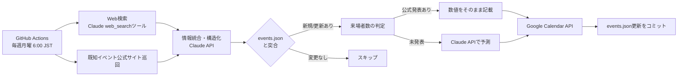

# 東海犬イベント自動収集システム

東海4県（愛知・岐阜・三重・静岡）で開催される犬メインのイベント・マルシェ（例: わんにゃんドーム、犬市場 等）の開催情報を毎週自動収集し、専用のGoogleカレンダーに登録するシステムです。

来場者数は公式発表があればそのまま記載し、未発表の場合はClaude APIによる予測値を「予測」と明記した上でカレンダーの備考欄に記載します。

詳細な設計・意思決定の経緯は [`docs/plan.md`](./docs/plan.md)（計画書）を参照してください。

## 主な機能

- 東海4県の犬イベント情報を、ClaudeのWeb検索ツール＋既知イベントシリーズの公式サイト巡回で収集
- Claude APIで検索結果を構造化イベント情報（名称・日程・会場・来場者数）へ変換
- 来場者数が未発表の場合、Claude APIが類似イベントの実績等をもとに幅を持たせて予測（「予測」と明記）
- Google Calendar APIで専用カレンダーへ自動登録・更新
- GitHub Actionsで毎週月曜 6:00(JST) に自動実行（手動実行も可能）

## アーキテクチャ



## リポジトリ構成

```
/.github/workflows/weekly-dog-event-search.yml
/scripts/
  run.js                  # エントリーポイント
  fetch_known_sources.js # 既知イベントシリーズの公式サイト巡回
  extract_events.js      # 検索結果 → 構造化イベント情報へ変換（Claude API）
  estimate_attendance.js # 来場者数予測（Claude API）
  sync_calendar.js       # Google Calendar API連携
  lib/
    anthropic.js          # Claude API呼び出し共通処理（モデル定義・構造化出力）
    googleCalendar.js     # Google Calendar APIクライアント
    date.js               # JST基準の日付ユーティリティ
/data/
  events.json             # 検出済みイベントの状態ファイル
  known_sources.json       # 巡回対象の公式サイトURL一覧
/docs/
  plan.md                  # 計画書（設計・意思決定の経緯）
/.env.example              # ローカル実行用の環境変数テンプレート
/README.md
```

## 使用モデル

用途ごとにモデルを分けています（`scripts/lib/anthropic.js` の `MODELS`）。

| 用途 | モデル | 理由 |
|---|---|---|
| イベント情報の抽出 | `claude-sonnet-5` | 「東海4県の犬メインイベントか」の判断に精度が要るため。adaptive thinking ＋ `effort: medium` |
| 来場者数の予測 | `claude-haiku-4-5` | 参考実績から幅を出すだけの単純タスクのため、安価なモデルで十分 |

## 事前準備

1. **Google Cloud Platform**
   - プロジェクトを作成
   - Google Calendar API を有効化
   - Calendar連携用のサービスアカウントを作成し、JSONキーを発行
2. **Google Calendar**
   - イベント専用の新規カレンダーを作成
   - 作成したカレンダーの共有設定で、サービスアカウントのメールアドレスに「予定の変更」権限を付与
   - カレンダーIDを控える
3. **Anthropic**
   - Claude APIキーを発行（[console.claude.com](https://console.claude.com)）
4. **GitHub**
   - 本リポジトリを作成し、以下のSecretsを登録

## GitHub Secrets

| Secret名 | 内容 |
|---|---|
| `ANTHROPIC_API_KEY` | Claude APIキー（Web検索もこのキーで行います） |
| `GOOGLE_SERVICE_ACCOUNT_KEY` | Calendar連携用サービスアカウントのJSONキー（base64推奨） |
| `GOOGLE_CALENDAR_ID` | 登録先カレンダーのID |

## 実行方法

### GitHub Actions

- **自動実行**: `.github/workflows/weekly-dog-event-search.yml` により毎週月曜 6:00(JST) に自動実行されます
- **手動実行**: Actions タブから `weekly-dog-event-search` を選択し `Run workflow` で即時実行できます。`dry_run` にチェックを入れると、カレンダー登録と `events.json` の更新を行わず抽出結果の確認だけができます

### ローカル実行

Node.js 20以上が必要です。

```bash
npm ci
cp .env.example .env   # 値を埋める

npm run dry-run        # ドライラン: カレンダーに書き込まず抽出結果だけ確認
npm run dev            # 本番実行: カレンダー登録・events.json更新まで行う
```

**ドライラン（`DRY_RUN=1`）では Google Calendar クライアントを生成しない**ため、`ANTHROPIC_API_KEY` の1つだけで実行できます。GCP のサービスアカウント設定が済む前でも、抽出精度とプロンプトの調整を進められます。

## 運用ルール

- **収集範囲**: 愛知・岐阜・三重・静岡で開催される犬メイン（犬猫混合含む）のマルシェ・ドーム型イベント。個人の小規模オフ会等は対象外
- **収集期間**: 実行日（JST基準）から6ヶ月先まで。抽出プロンプトで指示したうえで、`run.js` 側でも開催日による機械的フィルタをかけています（モデルの判断だけに依存させないため）
- **名寄せ**: 開催日 ＋ イベント名の緩い一致（表記ゆれ許容）で同一イベントと判定
- **開催終了・次回未発表のイベント**: 公式発表が出るまでカレンダーには登録しない
- **予測値の再更新**: 公式発表を検知した時点で自動的に「確定（公式発表）」表記に更新
- **known_sources.jsonの初期リスト**: わんにゃんドーム・犬市場の2シリーズから開始（随時追加可能）

## コスト目安

GitHub Actions・Google Calendar APIは無料。コストが発生するのはClaude APIのトークン費用とWeb検索料金のみで、**月額 約$1〜3（¥150〜450程度）** を想定しています。

抽出をSonnet 5、予測をHaiku 4.5（$1/$5）に分けたことで、当初の単一モデル構成の想定（月額 約$2〜6）より圧縮されています。なお **Sonnet 5 の導入価格（$2/$10）は2026-08-31で終了**し、9月以降は標準価格の$3/$15になります。詳細は [`docs/plan.md`](./docs/plan.md) の「10. コスト試算」を参照してください。
