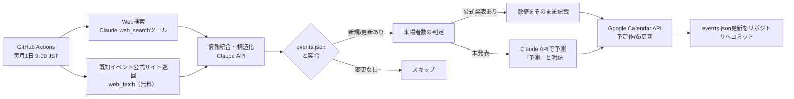

# 東海4県 犬イベント自動収集・Googleカレンダー反映システム 計画書

作成日: 2026-08-08（更新版: Instagram連携なし・低コスト構成）

## 1. 目的

東海4県（愛知・岐阜・三重・静岡）で開催される犬メインのイベント・マルシェ（例: わんにゃんドーム、犬市場 等）の開催情報を毎月自動収集し、専用のGoogleカレンダーに登録する。各イベントの来場者数は、公式発表があればその数値を、なければClaude APIによる予測値を「予測」と明記した上で備考欄に記載する。

**方針**: GitHub Actions・Google Calendar APIは無料枠内で運用し、コストはClaude API（情報抽出・来場者数のAI予測・Web検索）に限定する。Instagram等SNSからの収集は行わない。

> 当初は「Web検索も無料枠（Google Custom Search API）で賄う」方針だったが、2026年1月のGoogle側の仕様変更によりウェブ全体検索が新規に利用できなくなったため、Claudeのweb_searchツールに切り替えた（4-1参照）。追加コストは月あたり約$0.35で、全体予算に対して誤差の範囲。

## 2. 全体フロー



## 3. 収集対象の定義（デフォルト案・要確認）

- 対象地域: 愛知・岐阜・三重・静岡の4県で開催（会場所在地基準。主催・拠点が県外でも東海4県内開催なら対象に含める想定）
- **東海4県外の例外（2026-08-14 追加）**: 「インターペット」東京・大阪のみ対象に含める。
  国内最大級のペット総合展示会であり、東海圏からの遠征対象となるため。
  `known_sources.json` に公式の開催概要ページを登録して確実に巡回し、抽出プロンプトでも毎回の検索を指示している。
  `prefecture` の選択肢に東京都・大阪府を追加したが、**インターペット専用**と明記して他イベントの流入を防いでいる。
  - インターペット東京: 例年4月頃、東京ビッグサイト。第16回=2027年4月1日〜4日
  - インターペット大阪: 例年6月頃、インテックス大阪。第5回=2027年6月11日〜13日
  - **注意**: どちらも収集期間（6ヶ月先まで）の外にあるため、当面カレンダーには登録されない。
    自動的に対象へ入るのは東京が2026年10月1日の実行から、大阪が2027年1月1日の実行から。
    期間延長やシリーズ単位の例外は設けない方針（2026-08-14 判断）
- 対象イベント: 犬単独、または「わんにゃんドーム」のように犬猫混合でも犬の比重が大きいマルシェ・ドーム型イベント
- 規模の目安: 個人の朝散歩オフ会等の小規模イベントは除外し、複数ブース出展・集客型のマルシェ／展示会規模を対象
- 1回あたりの目標収集件数: **20件程度**（`extract_events.js` の `TARGET_EVENTS`）。月1回実行のため取りこぼしを避けて網羅的に探す。ただし件数合わせで基準を満たさないイベントを含めることは禁止しており、基準を満たすものが20件に届かなければ届いた分だけを返す
- 検索対象期間: 直近〜6ヶ月先に開催されるイベント（デフォルト。必要に応じて調整可）
  - **実装済み**: `run.js` の `HORIZON_MONTHS` で期間を定義。抽出プロンプトに「本日」と「6ヶ月先」を動的注入したうえで、`run.js` 側でも開催日による機械的フィルタをかける二重構造。基準日はJST（`scripts/lib/date.js` の `todayJst`）— Actionsランナーは UTC で動くため、単純な `toISOString()` では実行日が1日ずれる

## 4. データ収集方法（完全無料構成）

### 4-1. Web検索 — Claude の web_search サーバーツール

> **2026-08-13 変更**: 当初は Google Custom Search JSON API（無料枠）を使う設計だったが、
> **2026年1月20日付で Programmable Search Engine の「ウェブ全体を検索」が新規エンジンでは選択できなくなった**。
> 新規エンジンは最大50ドメインの「検索するサイト」方式のみで、未知のイベントを発見するという
> 本システムの中核が成立しない（既存エンジンは2027年1月1日まで猶予、Custom Search JSON API自体も終息方向）。
> このため Claude の web_search サーバーツールに切り替えた。

- `scripts/lib/anthropic.js` の `webSearchTool()` で `web_search_20260209` を定義し、抽出呼び出しに同梱する
- 検索は Anthropic のサーバー側で実行されるため、クライアント側の検索実装も検索用APIキーも不要
- `user_location` に日本（`country: 'JP'` / `timezone: 'Asia/Tokyo'`）を指定して日本語圏の結果を優先させる
- `max_uses: 25`（`extract_events.js` の `MAX_SEARCHES`）で1回の実行あたりの検索回数を制限
  （$10 / 1,000検索 → 月1回実行で約$0.25）
  - **未解明の挙動**: 上限8を指定した実行で17回、次の実行で13回と、指定を超える検索が観測された。
    上限10にした実行では1ターン・9回で収まり超過は再現していない。原因は特定できていない。
    `runStructured` はターンをまたぐ累計を数えて残数を `max_uses` に反映し、使い切ったら
    `tool_choice` で記録ツールを強制して打ち切る。あわせてターンごとの検索回数と
    指定超過の警告をログ出力するようにしてあるため、再発時は切り分けられる
- クエリはモデルが状況に応じて組み立てる。県名・地域名と「犬 イベント」「ドッグイベント」「犬 マルシェ」の組み合わせ、
  年の付与、公式サイトで次回未確定だったシリーズの個別検索を、システムプロンプトで指針として与えている
- 検索と構造化抽出は1回のAPI呼び出しにまとまる（サーバー側ツールのため往復不要）。
  サーバー側ループ上限に達した場合は `stop_reason: pause_turn` を検出して再開する

### 4-2. 情報源の直接巡回と自動学習（無料）

**設計変更（2026-08-29）**: 採用イベント21件の情報源を調べたところ、11ドメインに集中しており、
うち上位は `pettena.jp`(6件) `inumatsuri.com`(3件) `wannyan-smile.com`(2件) `pets-support.com`(2件) と、
すべて**イベントまとめサイト**だった。つまり毎月25回の検索を使って、同じ数ページを再発見していた。
これらはURLが固定なので、検索せずに直接取得できる。

巡回対象を2種類に分ける。

- `data/known_sources.json`（手で管理）: 公式サイト。わんにゃんドーム／犬市場／わんだらけ／インターペット東京・大阪
- `data/discovered_sources.json`（自動管理）: 実行結果から学習したイベントまとめサイト

**自動学習のルール**（`scripts/lib/sources.js`）:

- イベントを供給したURLは**1件からすぐ学習**する
- `known_sources.json` に登録済みのホストは学習しない（重複巡回を避ける）
- ヒットしなかった情報源は `misses` を増やし、**3回連続で0件なら削除**する
- **供給実績が1件のまま不発になったものは1回で削除**（単発記事は掲載イベントが終われば二度とヒットしないため）
- 供給実績の多い順に**最大12件**、同一ホストからは**最大2件**まで保持

> **見直しの経緯（2026-08-29）**: 当初は「1回で2件以上供給」を学習条件にしたが、実行結果で学習0件となった。
> 良質なまとめサイト4件は既に登録済みで更新扱いになり、残りはすべて1件供給だったため。
> 「一覧ページか単発記事か」をページ内容（期間内の日付記述数）で見分ける方式も検討したが、
> **実測で逆転が起きて使えなかった**（良質な `inumatsuri.com` は6件、単発記事の
> `odekake-wanko-bu.com/canicross-shizuoka/` は18件）。
> 判定を内容ではなく**時間**に委ね、まず記憶して続かなければ落とす方式に変更した。
> 検証: 実行1で新規4件を学習 → 実行2で再ヒットした `magazine.cainz.com` は4件に成長、
> 不発だった単発記事3件は即削除された。

これにより web_search は「未知のイベントの発見」に専念できる。抽出プロンプトでも
「まず添付本文を読み切り、そこに無いイベントを探すために検索する」と役割を明示している。

**本文の切り出し（`extractRelevant`）**: まとめサイトは長大なため、1ページ8000文字の上限に収める必要がある。
先頭から機械的に切ると上部のナビゲーションで予算を使い切り後方が落ちる（実測: `wannyan-smile.com` は
日付記述606件中160件しか載らなかった）。日付の周辺を集めるだけでも、日付が密なページでは窓が全体に融合して
先頭切り出しと変わらない（163件）。そこで**収集期間内の日付を含む範囲を優先**し、残り予算で期間外を拾う方式にした。
結果、9情報源から**期間内の日付記述364件**を取り込めている。

### 4-2-1. 既知イベントシリーズの公式サイト直接巡回（無料）

- 既に把握している主要シリーズ（わんにゃんドーム、犬市場 等）の公式サイト・お知らせページURLをリスト化し、毎月`web_fetch`相当の処理で直接取得
- 検索エンジン経由では拾いにくい「更新されたばかりの告知」も安定して取得できるため、4-1を補完する位置づけ
- 費用は発生しない（単純なHTTP取得のみ）
- 応答のないサイトで実行全体が止まらないよう、20秒のタイムアウトを設定

> **わんにゃんドームのURL修正（2026-08-13）**: 当初 `https://wannyandome.com/` を登録していたが、
> このドメインはさくらインターネットの初期ページ（403）を返すだけで機能しておらず、
> HTTPSも共有証明書（`*.sakura.ne.jp`）のためホスト名不一致で接続できない。
> 実体はテレビ愛知の `https://tv-aichi.co.jp/wannyan/` に移っている。
> このURLは年を含まないため常に最新年の情報を返す（現在はわんにゃんドーム2027＝2027年2月13〜14日）。

### 4-3（見送り）Instagram等SNS収集

- ご要望により見送り。将来的に必要になった場合は、公式Instagram Graph API（無料だが週30ハッシュタグ上限＋Meta審査必須）を候補として再検討可能

## 5. 来場者数の判定ロジック（Claude API使用箇所）

1. 4-1・4-2で集めた検索結果・ページ本文に公式発表数値（主催者発表、ニュース記事等）が含まれる場合 → その数値をそのまま採用し「確定（公式発表）」と明記
2. 含まれない場合 → Claude APIに以下の情報を渡して予測させる:
   - イベント名・開催日数・会場（種類・想定収容規模）
   - 同シリーズの過去回の実績（検索で取得できた場合）
   - 類似規模イベントの参考値（例: インターペット東京 約77,878人 等）
   - 出展者数などの補助情報
3. 予測結果は「約◯,000〜◯,000人（AI推定）」のように**幅**を持たせ、必ず「予測」であることを明記

**予測の是正（2026-08-13、初回ドライラン結果を受けて）**: 初回実行で3件すべてが12,000〜22,000人と過大に予測され、根拠にわんにゃんドームの実績（18,872人）が別シリーズの実績として流用されていた。原因は、予測モデルに会場の性質を判断する材料が渡っておらず、プロンプトが「分からなければ参考実績と同程度と仮定」する作りだったこと。対策として以下を実施:

- 抽出時に `venue_type`（屋内展示場／屋外の公園・河川敷／商業施設／その他・不明）、`admission`（有料／無料／不明）、`booth_count` を取得し、予測モデルへ渡す
- 予測プロンプトで、確認済み実績はわんにゃんドームのものだけであることを明示し、他シリーズへの流用を禁止
- 会場種別ごとの規模感の違い（屋外無料は天候依存で数千人規模にとどまることも多い、商業施設内は専有面積が狭い等）を明示
- 情報が乏しい場合は幅を広げるよう指示（上限が下限の2倍程度でも可）
- `basis` に会場種別の判断と根拠を明記させ、未確認の数値を実績として書かせない

**取りこぼし対策（2026-08-14、わんだらけ未検出を受けて）**: 初回本番実行で「わんだらけマルシェ」（2026/10/3-4・愛知県弥富市）が収集されなかった。調査の結果、原因は検索の失敗ではなく**抽出時の取りこぼし**と判明した。

- 該当イベントは `wannyan-smile.com/column-list/c1/` に会場・日付とも完備した状態で掲載されており、かつ**このページは他の収集済みイベント2件の典拠として実際に使われていた**。モデルはページを読んだうえで拾えていない
- 同ページには東海4県のイベントが11件掲載されていたが、収集できたのは4件。**1ページで7件を取りこぼしていた**
- 検索回数は上限25に対し実測9回で、検索は不足していない。検索回数を増やしても解決しない
- 原因は、全国のイベントが混在する高密度な集約ページから県で選別しながら列挙する処理で、生成モデルが漏らしやすいこと。加えてプロンプトが除外方向（厳守事項9項目）に偏り、網羅性の指示が弱かったこと

対策として `record_events` ツールに `candidates` 配列を追加した。

- 除外したものも含め、見つけたイベントを**全件記録**させる（`included` と `reason` 付き）
- 「列挙してから選別する」という順序を**出力構造として強制**する
- `run.js` で候補数・採用数・除外理由をログ出力し、**取りこぼしと意図的な除外を区別できる**ようにした
- API呼び出し回数と検索料金は不変。増えるのは出力トークンのみ

**過去イベントへの浪費とシリーズ次回の未確認（2026-08-28、初回本番実行のログより）**: `candidates` の記録により、取りこぼしの内訳が判明した。

- 候補30件・採用7件・除外23件。**除外23件のうち17件が「開催日が本日より前」**で、検索の大半が終了済みイベントの掘り起こしに費やされていた。集約サイトが年間アーカイブを持つため過去記事に引きずられる
- 結果として **web_search が上限25回に張り付き**（前回は9回）、期間内のイベントを確認しきる余力を失った。
  「旭高原元気村 秋のわんこマルシェ(2026-09-26)」「ドッグマルシェ富士山」が確認不足のまま除外されている
- **わんだらけは候補に挙がったが日付が誤り**。4月の名古屋港開催（終了済み）を見つけて「対象期間外」として除外しており、
  期間内にある10月3〜4日・弥富市富浜緑地の開催回に到達していない。シリーズは認識できたが過去回で打ち切っていた
- 採用件数は前回11件→今回7件と再現性が低下

対策（2026-08-28）:

- 検索クエリに**対象の年月を明示**させる。`monthRange()` が収集期間の各月を「2026年10月」形式で生成し、プロンプトへ渡す。年だけを付けると春〜夏の終了済み記事を大量に引くため
- **過去日付でシリーズを見つけた場合、それだけでの除外を禁止**。「イベント名＋次回」「イベント名＋対象月」で追加検索し、期間内の開催回を確認させる。会場が前回と変わる場合があるため最新の告知ページを見るよう指示。単に「日付が過去だから」という reason は認めない
- `MAX_SEARCHES` の引き上げ（25→40）は**見送り**。上限に張り付いた原因は過去イベントへの浪費であり、上記2点でその無駄が解消されれば25で足りる見込み。原因を潰す前に上限を上げると症状に蓋をすることになる。次回実行のログで25に張り付くかを測ってから判断する

> **訂正（2026-08-29）**: 上記で「わんだらけ公式サイトはJSレンダリング型で日付を抽出できない（54万文字中ゼロ）」と記載したが**誤り**だった。
> 調査時のシェルコマンドが `<script>` を除去しきれずJavaScriptを本文として数えていたことによる誤判定で、
> 本体の `htmlToText()` で整形すると**3,210文字**に収まり、開催日・会場・参加費がすべて含まれる。
> 2026-08-29 に `known_sources.json` へ追加した（5/5件の取得成功を確認済み）。

情報の構造化（検索結果 → イベント名/日程/会場等への変換）も同じくClaude APIで行う。Claude APIを使うのは「Web検索」「抽出」「予測」の3箇所。

**使用モデル（2026-08-13 決定）**: 抽出は判断精度が要るため `claude-sonnet-5`（adaptive thinking ＋ `effort: medium`）、来場者数予測は参考実績から幅を出すだけの単純タスクのため `claude-haiku-4-5` を使う。定義は `scripts/lib/anthropic.js` の `MODELS`。

> 注意: Haiku 4.5 は世代が異なり `output_config.effort` を受け付けずエラーになる。`runStructured` は `thinking` / `effort` を渡された時だけリクエストに載せる設計にしてある。また Sonnet 5 は `thinking` を省略しても adaptive thinking が動き、`max_tokens` は「思考＋出力」の合計上限として働く。抽出側は目標20件ぶんの構造化出力に思考トークンが加わるため 32000 としている。

### カレンダー備考欄フォーマット案

```
【来場者数】約5,000〜7,000人（AI推定 / 根拠: 前回シリーズ実績・会場規模）
【ステータス】未発表（AI予測）
【情報源】https://example.com/event-info
【収集日】2026-08-08
```

### 5-2. 抽出時の reason は行動の証拠にならない（2026-08-29 判明）

2回目の本番実行のログで、除外理由のうち**18件が「次回開催を検索したが対象期間内の開催を確認できず」と記載**していた。
しかし同じ実行の検索回数は**合計25回**であり、4県×対象月の網羅検索・インターペット2件・既知シリーズ確認を含めて
18件ぶんの追加検索が入る余地はない。**モデルは実行していない検索を「実行した」と書いている。**

- `candidates` の `reason` は「なぜ落ちたか」の手がかりにはなるが、**実際に行動した証拠として扱ってはいけない**
- 重要なシリーズを「モデルが検索してくれること」に依存させない。`known_sources.json` に登録して
  毎回確実にHTTP取得する経路に載せるのが唯一の確実な方法
- 実例: わんだらけは2回連続で未検出だった。1回目はページからの拾い漏れ、2回目は
  過去回（fest 47&48）を見つけて「次回を検索したが見つからず」と誤った除外。
  公式サイトを巡回対象に入れたことで、検索の当たり外れに左右されなくなった

### 5-3. シリーズの別開催回を誤統合した件（2026-08-29）

`木曽三川わんこマルシェ vol.28`（2026/10/3-4・国営木曽三川公園 芝生広場北ゾーン）が、
`海津アクア×木曽三川わんこマルシェ 2026秋`（2026/10/24-25・アクアワールド水郷パークセンター）と
**同一イベントとみなされて1件に統合**され、10/3の回がカレンダーから欠落した。

除外理由には「複数情報源で日付表記に揺れがあり、公式に近い情報に1件として統合」と記録されていた。
しかし両者は同じ木曽三川公園でも**別の施設**で開催される**別の回**である。

**原因は抽出プロンプトの指示文**にあった。

```
- 同一イベントが複数の情報源にまたがって出てきた場合は1件にまとめる
```

「同一イベント」の定義を書いていなかったため、名前が似ていれば開催日が違っても
「日付の表記ゆれ」と解釈して統合する余地を残していた。シリーズものは年に複数回開催されるのが
普通なので、この指示は取りこぼしを生む。

対策として、この指示に以下を追記した。

- 「同一イベント」とは**開催日まで同じもの**を指す
- 名前が同じでも開催日が違えば**別の開催回**として別々に記録する
- 日付が食い違って見えても安易に「表記ゆれ」と判断しない
- 迷った場合は**統合せず別々に記録する**（重複は後段の名寄せで吸収できるが、取りこぼしは復旧できない）

欠落していた10/3の回は手動でカレンダーへ登録済み。

## 6. 重複防止・状態管理

- GitHub Actionsは実行ごとに環境がリセットされるため、`data/events.json` をリポジトリ内に保持し「これまでに検出済みのイベント」を管理する状態ファイルとする
- 毎月の実行結果を`events.json`と突合し、新規イベントのみカレンダー登録、既存イベントは日程変更等があれば更新、なければスキップ
- 実行後、更新した`events.json`をActions自身がリポジトリにコミットして次回実行に引き継ぐ
- **名寄せ（同一イベント判定）**: 「開催日の完全一致」＋「イベント名の緩い一致」で判定する。
  開催日は緩めない（同名シリーズの別開催回を誤って統合しないため）。
  - **2026-08-29 修正**: 当初は名前の部分一致のみで判定していたが、
    同一イベントが実行ごとに「犬祭りテラス」「犬祭り（テラスゲート土岐）」「犬祭り in テラスゲート土岐」と
    異なる名前で抽出され、**どれも互いを含まないため3件が重複登録された**（実害4件）。
    文字バイグラムのDice係数による類似判定（閾値0.4）を追加し、
    同日・同会場なら名前が違っても同一とみなす保険も入れた。
    実測: 上記3名称間の類似度は0.47〜0.75、別イベント同士（デカケルわんこびより／海津アクア）は0.10
- **手動で作成した予定の扱い**: `sync_calendar` は実際のカレンダーではなく `events.json` と突合するため、
  手動で追加した予定は追跡されず、同じイベントを自動収集すると重複する。
  手動追加した場合は `events.json` にも `calendar_event_id` 付きで登録すること
  （2026-08-29 に「わんだらけ」1件を追跡下に追加済み。`manual_origin: true` を付与）
- **開催終了後・次回未発表のイベント**: 公式発表が出るまではカレンダーに登録しない（過去実績からの仮登録は行わない）
- **予測値の再更新**: 予測値で登録済みのイベントについて、後日の巡回で公式発表を検知した場合は自動的に「確定（公式発表）」表記に更新する（デフォルト方針。手動確認に切り替えたい場合は`estimate_attendance.js`のフラグで変更可能）

## 7. Googleカレンダー連携

- 新規専用カレンダー（例:「東海犬イベント」）を作成し、そのカレンダーIDを対象とする
- 認証方式: サービスアカウント（人手の再ログイン不要でGitHub Actionsから無人実行できるため）。GCPでサービスアカウントを作成し、対象カレンダーの「予定の変更権限」をサービスアカウントのメールアドレスに共有する
- Calendar APIの`events.insert`（新規）/`events.patch`（更新）を使用

## 8. GitHub Actions ワークフロー（設計イメージ）

```yaml
name: monthly-dog-event-search
on:
  schedule:
    - cron: '0 0 1 * *'    # 毎月1日 9:00 JST（UTC 1日 0:00）
  workflow_dispatch: {}     # 手動実行も可能にしておく

jobs:
  collect-and-sync:
    runs-on: ubuntu-latest
    steps:
      - uses: actions/checkout@v4
      - name: Run collection & sync script
        env:
          ANTHROPIC_API_KEY: ${{ secrets.ANTHROPIC_API_KEY }}
          GOOGLE_SERVICE_ACCOUNT_KEY: ${{ secrets.GOOGLE_SERVICE_ACCOUNT_KEY }}
          GOOGLE_CALENDAR_ID: ${{ secrets.GOOGLE_CALENDAR_ID }}
        run: node scripts/run.js
      - name: Commit updated state
        run: |
          git config user.name "event-bot"
          git config user.email "bot@users.noreply.github.com"
          git add data/events.json
          git commit -m "chore: update events.json" || echo "no changes"
          git push
```

## 9. リポジトリ構成案

```
/.github/workflows/monthly-dog-event-search.yml
/scripts/
  run.js                  # 上記を順に実行するエントリーポイント
  fetch_known_sources.js # 既知イベントシリーズの公式サイト巡回（無料）
  extract_events.js      # 検索結果 → 構造化イベント情報へ変換（Claude API）
  estimate_attendance.js # 来場者数予測（Claude API）
  sync_calendar.js       # Google Calendar API連携
  lib/
    anthropic.js          # Claude API呼び出し共通処理（モデル定義・構造化出力）
    googleCalendar.js     # Google Calendar APIクライアント
    date.js               # JST基準の日付ユーティリティ
/data/
  events.json             # 検出済みイベントの状態ファイル
  known_sources.json       # 巡回対象の公式サイトURL一覧（初期: わんにゃんドーム、犬市場の2シリーズ）
/.env.example              # ローカル実行用の環境変数テンプレート
/README.md
```

データファイルは実行時のカレントディレクトリに依存しないよう、`import.meta.url` を基準に解決している。

## 10. コスト試算（月額目安）

Anthropic公式レート（2026年8月時点）に基づく概算です。以下は**9月以降の標準価格**（Sonnet 5: 入力$3/出力$15、Haiku 4.5: 入力$1/出力$5、いずれも100万トークンあたり）で算出しています。

> **Sonnet 5の導入価格（$2/$10）は2026年8月31日で終了します。** 8月中は下表より2〜3割安く収まります。

| 項目 | 想定使用量 | 月額目安（USD） | 参考（円・1ドル150円換算） |
|---|---|---|---|
| GitHub Actions | 月1回・1回あたり10〜20分 | $0（無料枠内） | ¥0 |
| **Claude API — Web検索** | 1回あたり最大25検索 × 月1回 = 月25件（$10 / 1,000検索） | 約$0.25 | 約¥38 |
| 既知サイト巡回（HTTP取得） | — | $0 | ¥0 |
| Google Calendar API | — | $0 | ¥0 |
| **Claude API — 抽出（Sonnet 5）** | 月1回・入力10〜25万トークン／出力（思考含む）1〜2万トークン | 約$0.45〜1.05 | 約¥68〜158 |
| **Claude API — 予測（Haiku 4.5）** | 月20イベント × 入力約1,000／出力約300トークン | 約$0.05 | 約¥8 |
| **合計目安** | | **約$0.7〜1.4 / 月** | **約¥105〜210 / 月** |

- Instagram連携を見送ったことで、コストはClaude APIのトークン費用とWeb検索料金のみに圧縮されました。
- 当初は抽出・予測ともSonnet 5・週1回実行で月額$2〜6を見込んでいましたが、**予測をHaiku 4.5に分離**し、**実行頻度を月1回に変更**したことで下振れしています。1回あたりの検索回数と目標件数を増やしても、実行回数が1/4になった影響のほうが大きくなっています。
- 初月はプロンプト調整・テスト実行で上振れする可能性があります。ドライラン（`npm run dry-run`）はカレンダーに書き込まずに抽出・予測を実行するため、調整中もトークン費用は発生します。
- さらに費用を抑える余地としては、抽出の `effort` を `low` に落とす、公式サイト本文の切り出し上限（現在8,000文字）を下げる、といった選択肢があります（いずれも精度とのトレードオフは要検証）。

## 11. 導入ステップ（案）

1. GCPプロジェクト作成: Calendar API有効化、サービスアカウント発行とJSONキー取得
2. 専用Googleカレンダー作成、サービスアカウントに共有設定
3. GitHubリポジトリ作成、Secrets登録（ANTHROPIC_API_KEY / GOOGLE_SERVICE_ACCOUNT_KEY / GOOGLE_CALENDAR_ID）
4. 既知イベントシリーズ（わんにゃんドーム、犬市場 等）の公式サイトURLを`known_sources.json`にリスト化
5. Web検索＋抽出パイプラインの実装・手動実行での精度確認
6. 来場者数予測プロンプトの調整（過去実績データの与え方、表記フォーマットの確定）
7. GitHub Actionsへスケジュール登録、2〜3回分は手動実行で検証してから自動運用へ移行

## 12. 確定事項一覧（2026-08-08 決定）

| 項目 | 決定内容 |
|---|---|
| 名寄せ（同一イベント判定） | 開催日 ＋ イベント名の緩い一致（表記ゆれ許容）で判定 |
| 開催終了・次回未発表イベント | 公式発表が出るまでカレンダーには登録しない |
| 予測値の再更新 | 公式発表を検知した時点で自動的に「確定」表記へ更新する |
| known_sources.jsonの初期リスト | わんにゃんドーム・犬市場の2シリーズから開始（追加は随時可能） |

### 追加の確定事項（2026-08-13 決定）

| 項目 | 決定内容 |
|---|---|
| 使用モデル | 抽出=`claude-sonnet-5`（adaptive thinking ＋ effort: medium）／予測=`claude-haiku-4-5` |
| 日付の基準 | JST。Actionsランナーは UTC のため `scripts/lib/date.js` の `todayJst` で補正 |
| 期間フィルタ | プロンプト指示 ＋ `run.js` での機械的フィルタの二重構造 |
| ドライラン | `DRY_RUN=1` でCalendarクライアントを生成せず、Google認証情報なしで抽出精度を確認可能 |
| events.jsonの保持期間 | 終了から365日を過ぎたレコードは自動除去（カレンダー側の予定は残す） |
| Web検索の経路 | Google Custom Search API から Claude の `web_search_20260209` へ変更（Google側の仕様変更のため。4-1参照） |
| 必要なSecret | 5個 → **3個**（`GOOGLE_CSE_API_KEY` / `GOOGLE_CSE_CX` が不要になった） |

## 13. 進捗

- [x] 導入ステップ 1〜3 のうち、リポジトリ側の準備（構成整備・依存導入・実行可能化）
- [x] 導入ステップ 4: `known_sources.json` の初期リスト（わんにゃんドーム・犬市場）
- [x] 導入ステップ 5 の前半: Web検索＋抽出パイプラインの実装
- [ ] **導入ステップ 1〜3 のうち外部サービス設定**: GCPプロジェクト作成、Calendar API有効化、サービスアカウント発行、専用カレンダー作成と共有設定、GitHub Secrets登録 ← **次のアクション（ユーザー作業）**
- [ ] 導入ステップ 5 の後半: `npm run dry-run` での精度確認
- [ ] 導入ステップ 6: 来場者数予測プロンプトの調整
- [ ] 導入ステップ 7: Actionsへのスケジュール登録と2〜3回分の検証
