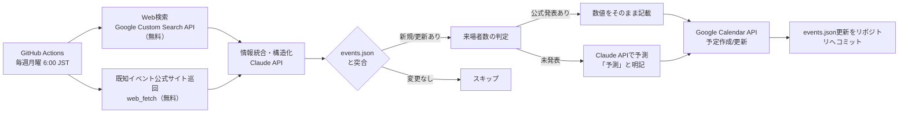

# 東海4県 犬イベント自動収集・Googleカレンダー反映システム 計画書

作成日: 2026-08-08（更新版: Instagram連携なし・低コスト構成）

## 1. 目的

東海4県（愛知・岐阜・三重・静岡）で開催される犬メインのイベント・マルシェ（例: わんにゃんドーム、犬市場 等）の開催情報を毎週自動収集し、専用のGoogleカレンダーに登録する。各イベントの来場者数は、公式発表があればその数値を、なければClaude APIによる予測値を「予測」と明記した上で備考欄に記載する。

**方針**: GitHub Actions・Web検索・Google Calendar APIはすべて無料枠内で運用し、コストが発生するのはClaude API（情報抽出・来場者数のAI予測に用いる推論部分）のみに限定する。Instagram等SNSからの収集は行わない。

## 2. 全体フロー



## 3. 収集対象の定義（デフォルト案・要確認）

- 対象地域: 愛知・岐阜・三重・静岡の4県で開催（会場所在地基準。主催・拠点が県外でも東海4県内開催なら対象に含める想定）
- 対象イベント: 犬単独、または「わんにゃんドーム」のように犬猫混合でも犬の比重が大きいマルシェ・ドーム型イベント
- 規模の目安: 個人の朝散歩オフ会等の小規模イベントは除外し、複数ブース出展・集客型のマルシェ／展示会規模を対象
- 検索対象期間: 直近〜6ヶ月先に開催されるイベント（デフォルト。必要に応じて調整可）

## 4. データ収集方法（完全無料構成）

### 4-1. Web検索 — Google Custom Search JSON API（無料枠）

- GCPで「Programmable Search Engine」を作成し、Custom Search JSON APIを有効化（1日100クエリまで無料）
- 毎週、以下のようなクエリを15〜25件程度実行:「東海 犬 イベント 2026」「愛知 犬 マルシェ」「わんにゃんドーム 次回」「犬市場 岡崎」等
- 想定利用量（週20件 × 4.3週 ≒ 月86件）は無料枠（月3,000件相当）に対して十分余裕あり

### 4-2. 既知イベントシリーズの公式サイト直接巡回（無料）

- 既に把握している主要シリーズ（わんにゃんドーム、犬市場 等）の公式サイト・お知らせページURLをリスト化し、毎週`web_fetch`相当の処理で直接取得
- 検索エンジン経由では拾いにくい「更新されたばかりの告知」も安定して取得できるため、4-1を補完する位置づけ
- 費用は発生しない（単純なHTTP取得のみ）

### 4-3（見送り）Instagram等SNS収集

- ご要望により見送り。将来的に必要になった場合は、公式Instagram Graph API（無料だが週30ハッシュタグ上限＋Meta審査必須）を候補として再検討可能

## 5. 来場者数の判定ロジック（Claude API使用箇所）

1. 4-1・4-2で集めた検索結果・ページ本文に公式発表数値（主催者発表、ニュース記事等）が含まれる場合 → その数値をそのまま採用し「確定（公式発表）」と明記
2. 含まれない場合 → Claude APIに以下の情報を渡して予測させる:
   - イベント名・開催日数・会場（種類・想定収容規模）
   - 同シリーズの過去回の実績（検索で取得できた場合）
   - 類似規模イベントの参考値（例: インターペット東京 約77,878人 等）
   - 出展者数などの補助情報
3. 予測結果は「約◯,000〜◯,000人（AI推定）」のように**幅**を持たせ、必ず「予測」であることを明記

情報の構造化（検索結果 → イベント名/日程/会場等への変換）も同じくClaude APIで行う。Claude APIを使うのはこの「抽出」と「予測」の2箇所のみで、検索そのものには課金される機能（Claude内蔵のWeb検索ツール等）は使わない。

### カレンダー備考欄フォーマット案

```
【来場者数】約5,000〜7,000人（AI推定 / 根拠: 前回シリーズ実績・会場規模）
【ステータス】未発表（AI予測）
【情報源】https://example.com/event-info
【収集日】2026-08-08
```

## 6. 重複防止・状態管理

- GitHub Actionsは実行ごとに環境がリセットされるため、`data/events.json` をリポジトリ内に保持し「これまでに検出済みのイベント」を管理する状態ファイルとする
- 毎週の実行結果を`events.json`と突合し、新規イベントのみカレンダー登録、既存イベントは日程変更等があれば更新、なければスキップ
- 実行後、更新した`events.json`をActions自身がリポジトリにコミットして次回実行に引き継ぐ
- **名寄せ（同一イベント判定）**: 「開催日」と「イベント名の緩い一致（表記ゆれを許容した部分一致）」で同一イベントと判定する
- **開催終了後・次回未発表のイベント**: 公式発表が出るまではカレンダーに登録しない（過去実績からの仮登録は行わない）
- **予測値の再更新**: 予測値で登録済みのイベントについて、後日の巡回で公式発表を検知した場合は自動的に「確定（公式発表）」表記に更新する（デフォルト方針。手動確認に切り替えたい場合は`estimate_attendance.js`のフラグで変更可能）

## 7. Googleカレンダー連携

- 新規専用カレンダー（例:「東海犬イベント」）を作成し、そのカレンダーIDを対象とする
- 認証方式: サービスアカウント（人手の再ログイン不要でGitHub Actionsから無人実行できるため）。GCPでサービスアカウントを作成し、対象カレンダーの「予定の変更権限」をサービスアカウントのメールアドレスに共有する
- Calendar APIの`events.insert`（新規）/`events.patch`（更新）を使用

## 8. GitHub Actions ワークフロー（設計イメージ）

```yaml
name: weekly-dog-event-search
on:
  schedule:
    - cron: '0 21 * * 0'   # 毎週月曜 6:00 JST（UTC日曜21:00）
  workflow_dispatch: {}     # 手動実行も可能にしておく

jobs:
  collect-and-sync:
    runs-on: ubuntu-latest
    steps:
      - uses: actions/checkout@v4
      - name: Run collection & sync script
        env:
          ANTHROPIC_API_KEY: ${{ secrets.ANTHROPIC_API_KEY }}
          GOOGLE_CSE_API_KEY: ${{ secrets.GOOGLE_CSE_API_KEY }}
          GOOGLE_CSE_CX: ${{ secrets.GOOGLE_CSE_CX }}
          GOOGLE_SERVICE_ACCOUNT_KEY: ${{ secrets.GOOGLE_SERVICE_ACCOUNT_KEY }}
          GOOGLE_CALENDAR_ID: ${{ secrets.GOOGLE_CALENDAR_ID }}
        run: node scripts/run.js
      - name: Commit updated state
        run: |
          git config user.name "event-bot"
          git config user.email "bot@users.noreply.github.com"
          git add data/events.json
          git commit -m "chore: update events.json" || echo "no changes"
          git push
```

## 9. リポジトリ構成案

```
/.github/workflows/weekly-dog-event-search.yml
/scripts/
  search_web.js          # Google Custom Search APIでのWeb検索（無料）
  fetch_known_sources.js # 既知イベントシリーズの公式サイト巡回（無料）
  extract_events.js      # 検索結果 → 構造化イベント情報へ変換（Claude API）
  estimate_attendance.js # 来場者数予測（Claude API）
  sync_calendar.js       # Google Calendar API連携
  run.js                  # 上記を順に実行するエントリーポイント
/data/
  events.json             # 検出済みイベントの状態ファイル
  known_sources.json       # 巡回対象の公式サイトURL一覧（初期: わんにゃんドーム、犬市場の2シリーズ）
/README.md
```

## 10. コスト試算（月額目安）

Anthropic公式レート（2026年8月時点）に基づく概算です。Claude Sonnet 5は2026年8月31日まで入力$2/出力$10（100万トークンあたり）の導入価格、9月以降は標準の$3/$15に戻ります。

| 項目 | 想定使用量 | 月額目安（USD） | 参考（円・1ドル150円換算） |
|---|---|---|---|
| GitHub Actions | 週1回・1回あたり5〜10分 | $0（無料枠内） | ¥0 |
| Google Custom Search API | 週15〜25検索 × 月4.3週 ≒ 月86〜108件 | $0（1日100件・月3,000件相当の無料枠内） | ¥0 |
| 既知サイト巡回（web_fetch） | — | $0 | ¥0 |
| Google Calendar API | — | $0 | ¥0 |
| **Claude API — トークン費用（抽出・予測のみ）** | Sonnet 5、週あたり入力4〜10万トークン／出力0.5〜1.5万トークン | 約$2〜6 | 約¥300〜900 |
| **合計目安** | | **約$2〜6 / 月** | **約¥300〜900 / 月** |

- Instagram連携を見送り、検索もGoogle Custom Search APIの無料枠に切り替えたことで、コストはClaude APIのトークン費用のみに圧縮されました。
- 初月はプロンプト調整・テスト実行で上振れする可能性があります。
- さらに費用を抑えたい場合、抽出・予測の一部をClaude Haiku 4.5（$1/$5）に切り替えることで追加で30〜50%程度削減できる見込みです（精度とのトレードオフは要検証）。

## 11. 導入ステップ（案）

1. GCPプロジェクト作成: サービスアカウント発行（Calendar用）、Custom Search JSON API有効化＋Programmable Search Engine作成
2. 専用Googleカレンダー作成、サービスアカウントに共有設定
3. GitHubリポジトリ作成、Secrets登録（ANTHROPIC_API_KEY / GOOGLE_CSE_API_KEY / GOOGLE_CSE_CX / GOOGLE_SERVICE_ACCOUNT_KEY / GOOGLE_CALENDAR_ID）
4. 既知イベントシリーズ（わんにゃんドーム、犬市場 等）の公式サイトURLを`known_sources.json`にリスト化
5. Web検索＋抽出パイプラインの実装・手動実行での精度確認
6. 来場者数予測プロンプトの調整（過去実績データの与え方、表記フォーマットの確定）
7. GitHub Actionsへスケジュール登録、2〜3回分は手動実行で検証してから自動運用へ移行

## 12. 確定事項一覧（2026-08-08 決定）

| 項目 | 決定内容 |
|---|---|
| 名寄せ（同一イベント判定） | 開催日 ＋ イベント名の緩い一致（表記ゆれ許容）で判定 |
| 開催終了・次回未発表イベント | 公式発表が出るまでカレンダーには登録しない |
| 予測値の再更新 | 公式発表を検知した時点で自動的に「確定」表記へ更新する |
| known_sources.jsonの初期リスト | わんにゃんドーム・犬市場の2シリーズから開始（追加は随時可能） |

これで本計画書の未確定事項はすべて解消。次のアクションは「11. 導入ステップ」に沿った実装フェーズへの着手。
